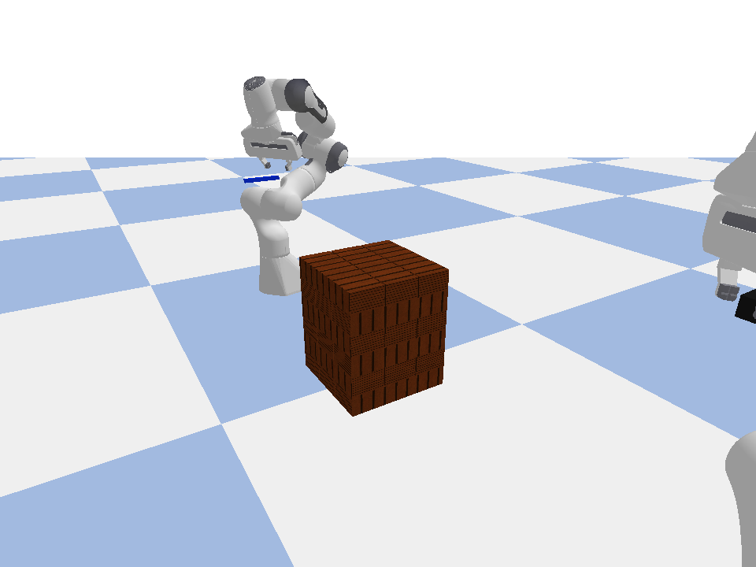
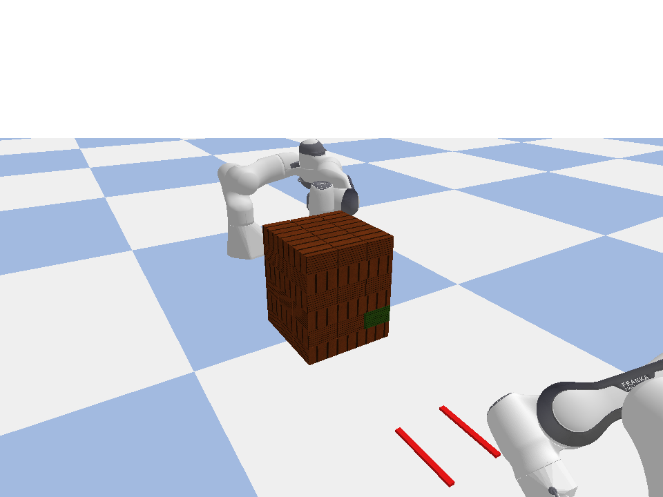
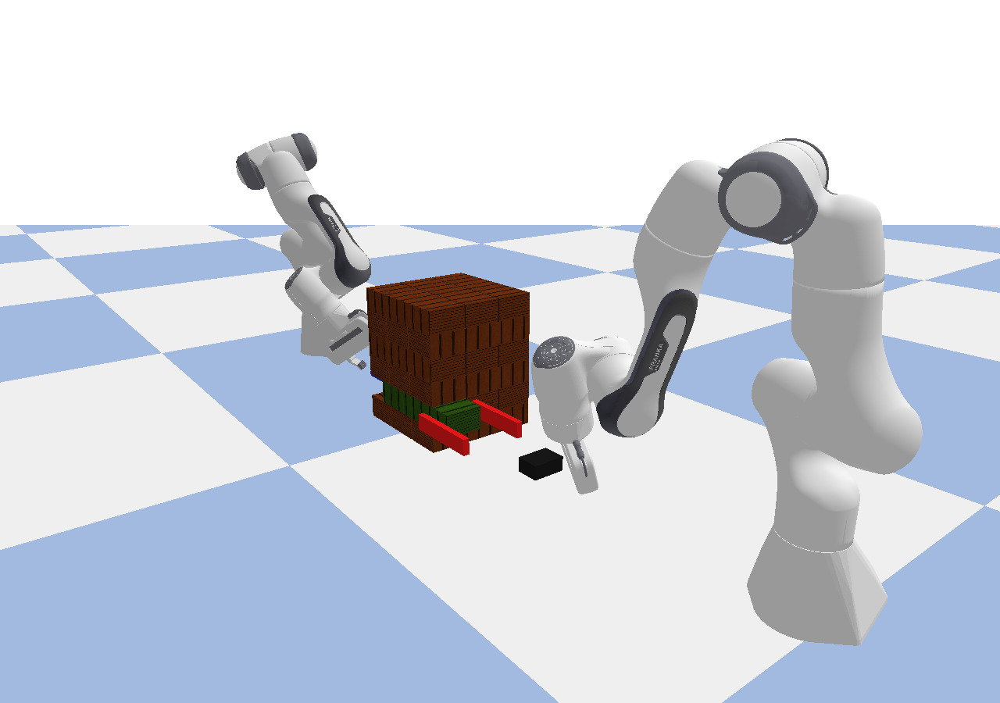

# Two-Robot Jenga RL

PyBullet 기반 3D Jenga 강화학습 프로젝트입니다. 최신 메인 환경은 **두 대의 Franka Panda 로봇이 협력해서 target block 하나를 안전하게 추출하는 환경**입니다.

- **Robot A**: scripted pusher. target block을 살짝 밀어 노출합니다.
- **Robot B**: PPO agent. custom Jenga gripper로 노출된 끝부분을 잡고 블록을 바닥으로 떨어뜨립니다.
- **Main env**: `TwoRobotJengaGripperEnv`
- **Main file**: `src/jenga_rl/envs/gripper_env.py`
- **Algorithm**: Stable-Baselines3 PPO (`MlpPolicy`)
- **Observation**: Robot B joint state, end-effector, target block, exposed grasp site, pull direction, stability metrics 등 36D
- **Action**: Robot B 7D joint residual + 1D gripper close command

## Before / After

### Before: untrained policy

학습 전 policy는 gripper가 target block에 안정적으로 정렬하지 못하고, 블록을 제대로 잡거나 추출하지 못합니다.


### After: PPO policy

PPO policy는 Robot A가 노출한 target block 끝부분으로 Robot B gripper를 이동시키고, 블록을 잡아 tower 밖으로 끌어냅니다.


## Simulation stills

| Untrained start | Untrained failure | Robot B gripper close-up |
| --- | --- | --- |
|  |  |  |

## 설치

```bash
git clone https://github.com/leecausemin/Robot_AI_HW2_Jenga.git
cd Robot_AI_HW2_Jenga
python3 -m venv .venv
source .venv/bin/activate
pip install --upgrade pip
pip install -e '.[train,dev]'
```

설치 확인:

```bash
python -m pytest -q
```

## 실제 시뮬레이션 실행 커맨드

아래 커맨드는 위 설치 과정에서 `.venv`를 activate한 뒤 repo root에서 실행합니다.

### 1. 학습한 PPO 모델로 PyBullet 시뮬레이션 실행

GUI 창에서 실제 simulation을 바로 보고 싶을 때 사용합니다. GIF를 만들지 않고, 학습된 policy가 환경 안에서 step-by-step으로 실행됩니다.

```bash
python scripts/sim_gripper.py \
  --policy ppo \
  --model runs/two_robot_gripper_precise_pusher_ft3k/model.zip \
  --seed 237 \
  --render-mode human
```

새로 학습한 모델을 실행하려면 `--model`만 바꾸면 됩니다.

```bash
python scripts/sim_gripper.py \
  --policy ppo \
  --model runs/two_robot_gripper_ppo/model.zip \
  --seed 237 \
  --render-mode human
```

GUI가 없는 환경에서는 `ansi` mode로 step 로그만 확인할 수 있습니다.

```bash
python scripts/sim_gripper.py \
  --policy ppo \
  --model runs/two_robot_gripper_precise_pusher_ft3k/model.zip \
  --seed 237 \
  --render-mode ansi \
  --sleep 0
```

### 2. PPO 학습 실행

```bash
python scripts/train_gripper.py \
  --timesteps 8000 \
  --out runs/two_robot_gripper_ppo \
  --levels 6 \
  --max-episode-steps 90
```

### 3. 발표용 GIF가 필요할 때만 기록

학습 전 untrained rollout:

```bash
python scripts/record_gripper.py \
  --policy untrained \
  --seed 217 \
  --out-dir docs/training_media/two_robot_gripper_far_b_exposed_tip \
  --levels 6 \
  --max-episode-steps 90
```

학습된 PPO rollout:

```bash
python scripts/record_gripper.py \
  --policy ppo \
  --model runs/two_robot_gripper_precise_pusher_ft3k/model.zip \
  --seed 237 \
  --out-dir docs/training_media/two_robot_gripper_far_b_exposed_tip \
  --levels 6 \
  --max-episode-steps 90
```

## 코드 구조

```text
src/jenga_rl/envs/config.py          # Jenga tower config base
src/jenga_rl/envs/panda_jenga_env.py # PyBullet/Panda/Jenga base environment
src/jenga_rl/envs/gripper_env.py     # latest main two-robot RL environment
scripts/sim_gripper.py               # run trained policy in the PyBullet simulation
scripts/train_gripper.py             # PPO training for main gripper env
scripts/record_gripper.py            # GIF/still rollout recording
tests/test_gripper_env.py            # smoke/regression test
```
